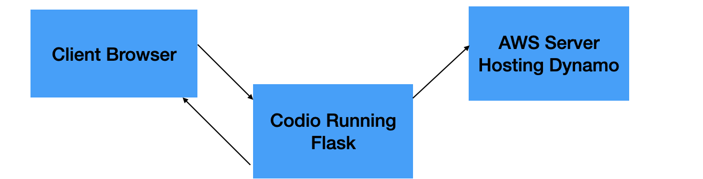

# Overview

## Project Overview

This is a product inventory and management Flask application. Users register, login, and are able to view 
an inventory of fruit that can be added to a cart. After selecting items the checkout page enables the item
list to be sent to AWS where a future downstream use of the orders can be extended.

## Application Features

Users are greeted with a welcome page with a recommended flow and site pages to go to via URL strings.

Registration and login is the first stage where user data is collected via a form. For registration emails
have some verification to make sure they are formatted as intended after submission. Errors here are shown
to the user so they know to fix. Upon success users are automatically redirected to the login page where 
they are asked to enter their email and password. In this case if they enter an email and password that 
has not been registered they are greeted with an error message. Upon success they are directed back to
home screen.

The inventory page contains a selection of items that can be added to a cart. Each item has the price and 
name along with a button for adding. Upon clicking the item is added to the ongoing cart.

After adding items the user can view the contents of the cart formatted with each item. When they select the
checkout button the contents of the cart are written to cloud storage and the current cart is cleared, allowing
for more items to be added to a separate cart and the process repeated.

The contents of the cart are written to a table in cloud storage. The contents are such that the user ID and 
email are stored along with the items for further processing such as placing the order can be done.

```
dynamodb = boto3.resource('dynamodb',
    region_name=Config.REGION_NAME,
    aws_access_key_id=Config.AWS_ACCESS_KEY_ID,
    aws_secret_access_key=Config.AWS_SECRET_ACCESS_KEY
)

table = dynamodb.Table('Orders')

for product in get_products_internal():
    item = {
        'order_id': str(time.process_time_ns()),
        'name': product['name'],
        'user_id': current_user.id,
        'user_email': current_user.email,
    }
    table.put_item(Item=item)
```

Rate limiting is implemented for API calls to prevent these from being spammed. Values are chosen so that
the intuitive usage of the app are able to work just fine. Only when manually testing out features quickly
is when these are expected to be triggered assuming normal app usage, and any bad usage should be caught 
and slowed by these limits.

```
@auth.route('/browser/register', methods=['GET', 'POST'])
@limiter.limit("5 per minute")
```

An example of load balancing can be found in the standalone loadbalancer folder. This demonstrates how 
load balancing could be applied to the ecommerce or similar apps to prevent server overload.

## Challenges Encountered
During development a number of challenges were encountered.

I wanted to make sure the actual code paths that were being used in the browser were being tested as much
as possible while still not manually spinning up the browser for every last bit of behavior verification.
By abstracting logic into a get_products_internal() that means that the API tests go through almost all
of the code paths that are used for the browser and provides some assurance of correctness.

When midway through setting up the browser support I ran into issues testing. Before a browser I was
testing API calls all through the terminal using Curl. This was keeping cookies for the login data 
on the backend, so when I tried to implement half of the browser then go through the Curl commands,
I didn't see the expected results in the browser. I went ahead and got all of the browser functionality
working and testing through there so that the cookies remain in the expected place (staying on the browser
when this is what is expected).

The Jinja syntax requires a mix of HTML and Python like code blocks to access the data sent. Once I
reviewed the API guide and examples I saw how this was to be done but this was not intuitive to me 
at first. I do however see the flexibility this gives you to be able to display data that has been
packed on the python side while staying largely in HTML syntax.

```
<body>
    <h2 style="color:blue;" > Products </h2>
    
        <h3> Name: {{product.name}} </h3>
        <h4> Description: {{product.description}} </h4>
        <h4> Price: {{product.price}} </h4>
        <h4> Stock: {{product.stock}} </h4>
        <h4> Image URL: {{product.image_url}} </h4>
        <hr>
    
</body>
```

Python's logging module required setting:

```
logging.basicConfig(level=logging.INFO, format='%(asctime)s - %(levelname)s - %(message)s')
```

in each file where the module is imported. This prevented interference with Flask's use of logging
and afterwards the console shows every manual invocation of logging and every API call in a clear
way.

While a production setup would benefit from Docker, this app was developed using Codio. The venv
setup in this case handles package versioning and the app runs on a Codio server whose web page
can be viewed on others' browsers. Codio settings do not appear to allow Docker to be used here
but for a custom hosting setup this should be straightforward to add.

The Python virtual environment sets up a venv/ folder and this must be included in the gitignore
to prevent the verbose files from being committed as well. After doing this iteration does not 
require reverting that folder. 

## System Configuration

Flask is used as the framework to host the app. Flask enables a number of built in capabilities such as
simple user login features, template rendering, and routes to add Python logic to GET and POST requests.

Users should provide Flask environment variables:

```
FLASK_APP=run.py
FLASK_ENV=development
SECRET_KEY=your-secret-key-here
DATABASE_URL=sqlite:///:memory:
```

as can be found in the .env_example (which should be changed to .env and be picked up by the app).

Codio was used during development to provide a simple and repeatable location to host the app and view it from
browsers. Codio enables a standard development environment.

A Python environment is created and activated using the venv module which takes care of package versioning and
standardization. A standard set of commands (included in the README) is used to create and install the dependencies
and run the app. This enables a brand new Codio virtual environment to be created each time development is to occur
and standardizing the versions for a consistent experience.

The browser is the primary way the app is intended to be used however there are pure API ways access some app
functionality as well such as registering, logging in, and viewing products. Please ensure the usage here is 
consistent. Cookies saved when using the pure API version via Curl commands won't be accessible when switching
over to the browser for example.

Cart management is implemented with a local DB. An in memory SQLite DB can be considered as this DB's use is 
just to track the user's products at the time they are creating the cart. The in memory SQLite DB is also 
used for unit testing to ensure the endpoints work as expected. Flask SQLAlchemy is used and the DB setup
passed via .env (covered below).

The Python logging module is used so that the app's functionality can be monitored during its use. INFO 
logs are output during every request along with its status in addition to updates on when DB initialization
and updating is beginning and finishing.

HTML forms are used to enable a browser interface. This is used to render the register, login, inventory,
product page with checkout. Buttons in the HTML are embedded that invoke the API command used to checkout
and send the user's products over to the AWS storage. For login and register HTML forms are used then the
data parsed on the Flask side to perform these functions.

```
<form method="post">
    <label for="email">Email</label>
    <input name="email" id="email" required>
    <label for="password">Password</label>
    <input type="password" name="password" id="password" required>
    <input type="submit" value="Login">
  </form>
```

```
<h1 style="color:red;" >    
        Add an apple for $0.99?
</h1>
<button onclick="fetch('/proxy/5000/products', {
    'method': 'POST',
    'headers': {'Content-Type': 'application/json'},
    'body': JSON.stringify({
        'name': 'Apple',
        'description' : 'A yummy fruit.',
        'price': .99,
        'stock': '',
        'image_url': 'https://en.wikipedia.org/wiki/Apple#/media/File:Pink_lady_and_cross_section.jpg'
}),
})">Add</button>
```

The inventory and product pages make use of Javascript buttons to send POST requests when buttons are
clicked. Because the requests are tested and behind Flask API routes this keeps the HTML and template
code very simple and able to rely on already tested interfaces.

The login and register forms make use of message flashing to signal when an error has been encountered.
In the Flask logic is where the error conditions are checked for and where an early exit is performed
and flash function invoked to be picked up in the HTML. Below is the way in HTML any flashed messages
are collected and shown to the user:

```

  
    <ul class=flashes>
    
      <h2 style="color:red;" >{{ message }}</h2>
    
    </ul>
  

```

An AWS account is expected, with a DynamoDB named Orders created. The purpose of this is to enable
downstream processing of the contents of this DB to facilitate actual order processing. The region,
AWS access key, and secret access key are to be included in the .env provided (see the example).



## Testing and Debugging

The app was tested throughout development. In addition to a final thorough test across devices and with user
feedback.

pytest is utilized for the unit tests where the API paths have fake inputs constructed and the expected output
verified. The setup can be extended so that other API endpoints can be tested via unit tests in a way that is
fast and simple.

```
def test_create_product(client):
    client.post('/register', json={
        'email': 'test@example.com',
        'password': 'test123'
    })
    client.post('/login', json={
        'email': 'test@example.com',
        'password': 'test123'
    })
    response = client.post('/products', json={
        'name': 'test name',
        'description' : 'test description',
        'price': .99,
        'stock': 'test stock',
        'image_url': 'test.url'
    })
    assert response.status_code == 201
```

For end to end testing the application is started in Codio then accessed via the web. From here each page is
visited starting with the homepage at app loadup. Registration and login followed by inventory and the product
page for checkout.

The login and registration forms have bad inputs (registering with an invalid email address and trying to log in
with an account that hasn't been registered) checked and invalid inputs are verified to have a message displayed
to the user. After this the inventory page is verified that the product selection can occur and when buttons are
clicked too frequently the rate limit kicks in. This is verified by seeing the errors in the terminal logs. Upon
successful selection the product page is verified to list out the intended products. Then the checkout button is
invoked and the cart is verified to have been cleared after this. Finally in the AWS console the DynamoDB contents
are viewed and verified to match the intended products.

The app was verified to load correctly in a number of different browser setups. A Mac laptop was the primary
development device and this was tested in the Chrome browser. In addition to this an AMD CPU running linux had
Firefox used to access the page and verify things worked as expected. This is possible because the site runs by
invoking it through the terminal in the Codio interface and producing a web link for other devices to access. An
iphone as well was used and verified that the contents showed up fine. In Firefox the browser was shifted and closed 
in different ways to make sure the formatting did not break. Finally a Windows desktop from another internet connection
was used.

The Chrome browser had the network throttling method used to mimic a slow internet connection. The result of this
was that although the interface took longer to respond to button clicks, there was no impairment to the overall 
functionality.

A dual session was tried where on the Macbook the app was run and loaded in the browser then used to register and
place an order. Without closing the browser or application the application was loaded onto Firefox and the exercise
repeated. Doing this resulted in the expected behavior and the DynamoDB contents reflected the expected incremented
user ID.

A user feedback session was conducted to go over the app's correctness and ease of use. A link was sent and the user
opened the links using separate tabs on their iPhone. This resulted in the products not being shown and errors being
encountered but after learning of the different tabs this was diagnosed as the issue. The cookies that are stored
during login are unique per tab so expectedly don't transfer when multiple tabs are used for registration and login.
After correcting this issue and moving to a windows desktop the rest of the end to end test worked as expected.

A piece of feedback from the user experience session was that it wasn't as clear from the onset how the app is to be
used. Ideally the app would have a clear flow without any need of manual intervention. After the session this was 
addressed with a more clear welcome screen that lists the different pages and a recommended flow. In addition to this
at the time of the session the inventory products used empty strings for the image URLs. This produces a confusing 
experience so instead these were swapped out with actual Wikipedia images of the items.

A second piece of feedback from the session was that there could be more intuitive confirmation when actions were taken.
I noted that at the moment the register and sign in do produce error messages, however things like adding to the shopping
cart don't produce a sort of confirmation message that indicates the action was a success. This is a nice piece of feedback
and is being considered for future iterations.

A note on the user experience session was that the user clicked through and added things far faster than I do when testing.
This makes sense in hindsight, and it made me consider whether the rate limits can be re-visited in the future to account 
for quicker usage patterns vs the slow testing that I would often do on the app.
